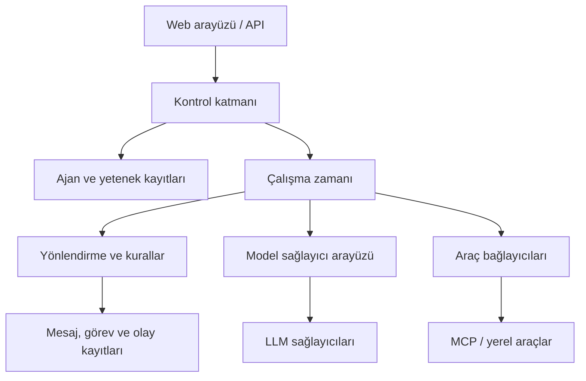

# Agent Runtime Platform

> **Durum:** Ürün vizyonu ve ilk sürüm taslağı. Bu repoda henüz çalışan uygulama bulunmuyor.

Agent Runtime Platform, yapay zekâ ajanlarını çalışma anında tanımlayıp yönetmek, yeteneklerine göre bulmak ve birbirleriyle izlenebilir biçimde konuşturmak için tasarlanan bir platformdur. Yeni bir ajan eklemek veya devre dışı bırakmak, her seferinde uygulama kodunu değiştirmeyi gerektirmemelidir.

## Ürün hedefi

Bir kullanıcı arayüzünden veya API'den ajan oluştur; modele, talimatlara, yeteneklere, araçlara ve iletişim izinlerine karar ver. Kullanıcı bir konuşma ya da görev başlattığında çalışma zamanı uygun ajanları seçsin, mesajları iletsin, sınırları uygulasın ve olup biteni kaydetsin.

**Temel ilke:** Ajan tanımı veridir; çalışma zamanı bu tanımı okuyarak ajanı çalıştırır. Ajan kayıtları, görevler, konuşmalar, mesajlar ve çalıştırma kayıtları ayrı kavramlardır.

## İlk sürümde kullanıcı ne yapabilecek?

1. Arayüz veya API üzerinden ajan oluşturacak, düzenleyecek ve devre dışı bırakacak.
2. Ajan için model sağlayıcısı, model, talimat, yetenek ve izin verilen araçları tanımlayacak.
3. Ajanlar arasında doğrudan mesaj gönderecek ve bir ajanın başka ajanı yeteneğine göre bulmasını sağlayacak.
4. Birden fazla ajanın katıldığı bir konuşma odası açacak.
5. Mesajları, görevleri ve çalıştırma olaylarını zaman çizelgesinde izleyecek.

Bu maddeler **hedeflenen özelliklerdir**; mevcut bir uygulamanın özellik listesi değildir.

## Kavramsal mimari



- **Kontrol katmanı:** Ajan tanımlarını, yetenekleri, araç izinlerini ve politikaları saklar; yönetim API'sini sunar.
- **Çalışma zamanı:** Tanımı belirli bir sürüm olarak yükler, modeli ve araçları çağırır, sonucu kaydeder.
- **Yönlendirme:** Mesajı hedef ajana veya yetenek aramasıyla bulunan ajana teslim eder; döngü ve bütçe sınırlarını denetler.
- **Kayıt katmanı:** Konuşmaları, görevleri, mesajları ve çalıştırma olaylarını kalıcı tutar.
- **Bağlayıcılar:** Modelleri ve araçları çalışma zamanından ayırır. MCP araç erişimi için, A2A ise ileride uzak ajan sistemleriyle birlikte çalışabilirlik için değerlendirilebilir.

Yönlendirme, izin ve limit kontrolleri öngörülebilir kurallarla çalışır. Ajanlar kendilerine verilen görev kapsamında içerik üretir ve izin verilen iletişim kararlarını alır.

## Ajan tanımı

Örnek bir kayıt:

```json
{
  "id": "agent_backend_01",
  "name": "Backend Developer",
  "description": "API development specialist",
  "instructions": "Design and implement backend tasks within the assigned scope.",
  "model": {
    "provider": "configured-provider",
    "name": "configured-model"
  },
  "capabilities": ["backend", "api"],
  "toolIds": ["repository", "filesystem"],
  "communication": {
    "canReceive": true,
    "canSend": true
  },
  "limits": {
    "maxTurns": 10,
    "maxDelegations": 5
  },
  "enabled": true,
  "version": 1
}
```

Bu örnek bir **kavramsal sözleşmedir**; uygulama API'si henüz tanımlanmış değildir. Model kimlikleri ve araç izinleri kuruluma göre doğrulanmalıdır. Anahtarlar ve erişim belirteçleri ajan tanımına düz metin olarak yazılmamalıdır.

Bir ajan devre dışı bırakıldığında eski konuşmaların ajan kimliği korunur. Her çalıştırma, kullanılan ajan tanımının sürümünü veya anlık görüntüsünü kaydeder; böylece geçmiş sonuçlar daha sonra açıklanabilir.

## Ajanlar nasıl konuşacak?

### Doğrudan mesaj

Bir ajan izin verilen başka bir ajana görev veya soru gönderir. Mesaj, konuşma ve varsa görev kimliğiyle saklanır.

### Yeteneğe göre keşif

Gönderen, sabit bir ajan adı yerine `postgresql` gibi bir yetenek isteyebilir. Kayıt katmanı uygun ve etkin adayları bulur; yönlendirme kuralları hedefi seçer. Birden çok aday veya hiç aday bulunmaması açıkça ele alınır.

### Devir ve koordinasyon

İleride bir ajan konuşmanın sorumluluğunu başka ajana devredebilir veya bir koordinatör birden çok ajana alt görev atayabilir. Bu akışlarda yetki, görev sahibi ve tamamlanma koşulu kayıtlı olmalıdır.

### Oda / grup konuşması

Bir konuşmaya birden fazla ajan katılabilir. Örneğin mimar, geliştirici ve güvenlik ajanı aynı konuda görüş belirtir. İlk sürümde söz hakkı sırası ve bitiş koşulu çalışma zamanı tarafından belirlenir; kontrolsüz, sonsuz ajan konuşmaları engellenir.

Örnek mesaj zarfı:

```json
{
  "id": "msg_123",
  "conversationId": "conv_987",
  "taskId": "task_123",
  "fromAgentId": "agent_analyst",
  "toAgentId": "agent_backend_01",
  "type": "task",
  "content": { "objective": "Design an authentication API" }
}
```

**Konuşma**, katılımcıların ortak bağlamıdır. **Görev**, yapılacak işin hedefi ve durumudur. Bir konuşmada birden fazla görev bulunabilir; bir görevin alt görevleri olabilir.

## Önerilen veri modeli

| Kayıt | Sorumluluk |
| --- | --- |
| `agents` | Kimlik, açıklama, talimat, model seçimi, durum ve sürüm |
| `agent_capabilities` | Yetenek tanımları ve eşleştirmeleri |
| `agent_tools` | Ajanın kullanmasına izin verilen araçlar |
| `agent_relations` | Gerekirse açık iletişim izinleri ve ilişkileri |
| `conversations` | Konuşma kimliği ve yaşam döngüsü |
| `conversation_members` | Konuşmaya katılan ajanlar |
| `messages` | Gönderen, alıcı, içerik ve zaman damgası |
| `tasks` | Hedef, atanan ajan, üst görev ve durum |
| `runs` | Bir ajan çalıştırmasının durumu ve ajan sürümü |
| `run_events` | Çalıştırma zaman çizelgesi ve hata ayıklama olayları |

Gerçek şema, gereksinimler ve ilk uygulama sırasında belirlenecek. Bir ajanın kullanıcı arayüzündeki “sil” işlemi geçmiş referansları kırmamak için devre dışı bırakma veya yumuşak silme olarak uygulanmalıdır.

## Sınırlar ve güvenilirlik

- Her mesajda gönderen, hedef, konuşma, görev ve izleme kimlikleri taşınır.
- Ajanların iletişim ve araç kullanımı izinlerle sınırlandırılır; model çıktısı tek başına yetki vermez.
- Tur, devir, süre ve maliyet limitleri; döngü tespiti ve durdurma mekanizması bulunur.
- Teslimat ve tekrar denemeleri aynı görevin yanlışlıkla iki kez sonuç üretmesini önleyecek biçimde tasarlanır.
- Hatalar, denemeler ve kararlar olay kayıtlarında izlenir; gizli bilgiler loglara yazılmaz.
- Çalışma sırasındaki bir ajan değişikliği, başlamış çalıştırmanın sürümünü geriye dönük değiştirmez.

## MVP kapsamı ve kabul ölçütleri

| İşlev | Kabul ölçütü |
| --- | --- |
| Ajan yönetimi | Yeni ajan oluşturulur; düzenlenir; devre dışı bırakılır; geçmiş mesajlar okunabilir kalır. |
| Model ve araç yapılandırması | Ajanın model ve izin verilen araçları kaydedilir; geçersiz seçimler reddedilir. |
| Keşif | Etkin ajanlar yetenekle aranır; sonuç yoksa açık hata döner. |
| Mesajlaşma | İki ajan arasında mesaj ve yanıt konuşma kaydında görünür. |
| Oda | Bir konuşmaya birden fazla ajan eklenir; sıra ve durdurma kuralı uygulanır. |
| İzlenebilirlik | Başlama, yönlendirme, araç çağrısı, hata ve bitiş olayları zaman sırasıyla görülebilir. |

İlk sürümün üzerinde çalışacağı en küçük uçtan uca senaryo: Kullanıcı iki ajan oluşturur; birine görev verir; bu ajan diğerini yeteneğine göre bulur; mesaj gönderir; yanıtı alır; kullanıcı bütün akışı ve sonucu arayüzde görür.

## Sonraki aşamalar

1. Görev devri, koordinatör akışı ve gelişmiş grup tartışmaları.
2. Kalıcı kuyruk ve dağıtık işçiler; yük arttığında Redis Streams, NATS veya benzeri bir bileşen değerlendirmesi.
3. MCP araç bağlayıcıları ve uzak ajan sistemleriyle A2A uyumluluğu.
4. Zamanlanmış görevler, bellek, onay akışları ve görsel ajan ilişkileri editörü.

## Teknoloji yönü

Başlangıç için React/Next.js arayüz, FastAPI servis, PostgreSQL kayıt katmanı ve değiştirilebilir model sağlayıcı arayüzü makul adaylardır. İlk aşamada ayrı bir mesaj kuyruğu gerekmeyebilir; işlem hacmi ve güvenilir teslimat gereksinimi ölçüldükten sonra seçilmelidir. Bunlar **öneridir**, kesinleşmiş mimari karar veya mevcut kurulum değildir.

Bu repo şu anda ürün tanımını barındırır. Kod, kurulum komutları, lisans ve çalışma garantisi henüz yoktur.
